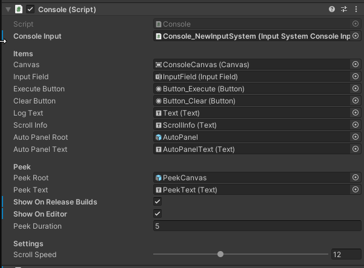
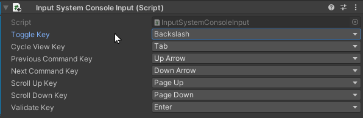

# Getting Started

## Installing Package

### OpenUPM Scoped Registry (2020.1 and newer)

Open Project Preferences and go to Package manager Window.

If not present, add this scoped registry:

* Name: **OpenUPM**
* URL : `https://package.openupm.com`
* Scopes : `net.peeweek`

Once added, you can close the project settings window.

Open Package manager (Window/Package Manager), select the Console package, and click the install button.

### Local Package Install

Either Clone the repository and reference the `package.json` in the Package Manager UI.

## Setting Up Console

By default, Console will enable itself with no further set-up. The system will instantiate a console prefab at game startup based on the following rules:

* Prefab is in a Resources Folder
* Prefab is named `Console_LegacyInput` or `Console_NewInputSystem` and will be instantiated depending on the currently active input system. 

Prefab is created upon `[RuntimeInitializeOnLoad]` and stored into the `DontDestroyOnLoad` transient scene.

### Default Configuration

The two default prefabs are located as read-only in the Package's Resources folder:

* `Default_Console_LegacyInput`
* `Default_Console_NewInputSystem`

In order to verify if it's properly configured. Enter play mode and press the Backslash `\` key. This should open the  console. 

For further instructions about controls, see [Using Console](using-console.md) page. 

### Customize Console

In order to customize the console prefab, you can create copies or variants of the default prefabs in your project's `Assets/Resources/` folder, and remove the `Default_` prefix.

These prefabs will be instantiated with higher priority than the default ones.

* **Console Input :** a reference to the Input Wrapper Component that handles either the legacy or new input system. You can derive `ConsoleInput` abstract class to create your own input. 
* **Items**:
  * Canvas : the base canvas that will be toggled when displaying the console
  * Input Field : the Input Field used to type commands
  * Execute Button : the button used for executing commands
  * Clear Button : the button used for clearing the text of the console
  * Log Text : the text component used to display the output of the console
  * ScrollInfo : an additional text showing which page of the output we're currently at
  * AutoPanelRoot: the reference to the context-sensitive panel that display information as you type
  * AutoPanelText: the reference to the panel text to display information.
* **Peek** : Elements of the peek Feature
  * Peek Root : the base canvas of the peek feature
  * Peek Text : the base text of the peek feature
  * Show On Release Builds : whether to show Peek on release builds, or only on dev builds
  * Show On Editor : whether to show Peek in editor
  * Peek Duration : in seconds. how long logs are displayed
* **Settings**
  * Scroll Speed : how many lines are scrolled every time a page down/up is performed

### Input

Based on your current Input System, the prefab will require a compatible Input component.

Here's for example the **InputSystemConsoleInput** component for the new input system.

This component enables setting up the controls for the console.

