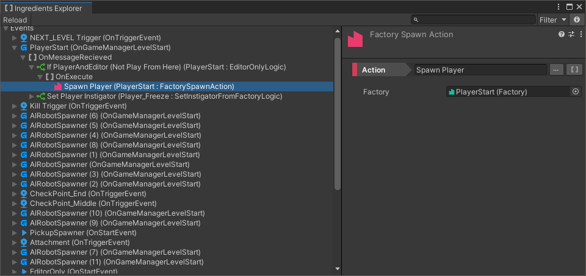

# Callable Tree Explorer

**Version:** 2019.1.3

Callable Tree Explorer is an Editor Window that alllows displaying and filtering [Callable Hierarchy](events-logic-actions.md) within currently loaded scene.

## How To

In order to open the window use the menu `Window/Gameplay Ingredients/Callable Tree`