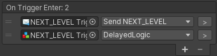

# Callables

Callables is an abstraction of visual scripting that defines the core of Gameplay Ingredients Runtime. A Callable is an object that can be Called, to perform a certain task. 

## Instigators

Callables can be called by an **Instigator**, a source object that did cause the script to execute, and that can be processed by any Callable in the chain of calls.

> For Example : A OnTriggerEnter Event, can call a Delay Logic, then a Destroy Object Action defined on the instigator. In this case, the Instigator will be set by the OnTriggerEvent to be the object that entered the trigger (for example, the player). Then it will be passed to the Delay Logic, then to the Destroy Object. This action will know that it was the player that entered the trigger and will be able to destroy it.

## Editing Callable Lists

Events, Logic and Actions (but also other components such as [States](state-machines.md), [Managers](managers.md), [Factories](factories.md), ... ) can call scripts from other callable components. Editing in inspector of these lists can be achieved through a reorderable list where calls can be added in chronological order.



* Click the + button to add a new entry, then drag onto the Object field the game object or the component you want to add.

* You can use the popup drop-down to select any callable component on the target game object.

## Previewing the hierarchy of calls

You can preview the hierarchy of calls in editor by using the [Callable Tree Explorer](callable-tree-explorer.md) Window. This window allows you to get an overview of what's being called.

You can also enable Verbose Call Logging in the Gameplay Ingredients Settings asset

## Calling Callables (C#)

Callables can be Called using the Static Method `GameplayIngredients.Callable.Call(call, instigator)` where call can be of the following:

* single `Callable` object
* `Callable[]` array

instigator parameter is of type `GameObject` and defaults to `null` so it's mandatory.

## Writing Callables

You can write your own callables my making them derive from the `ICallable` interface, or derive from `GameplayIngredients.Actions.ActionBase` or `GameplayIngredients.Logic.LogicBase` if you prefer to be consistent to the  [events-logic-actions](events-logic-actions.md) philosophy.

The `ICallable` interface is pretty straightforward:

```C#
using System.Collections;
using System.Collections.Generic;
using UnityEngine;

namespace GameplayIngredients
{
    public interface ICallable
    {
        void Execute(GameObject instigator = null);
    }

}
```

Implementing Callables enable you to reference them in the Callable Lists, and view them in the [Callable Tree Explorer](callable-tree-explorer.md) 