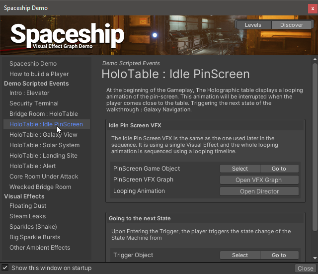
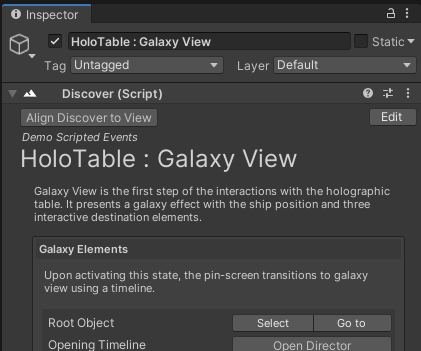
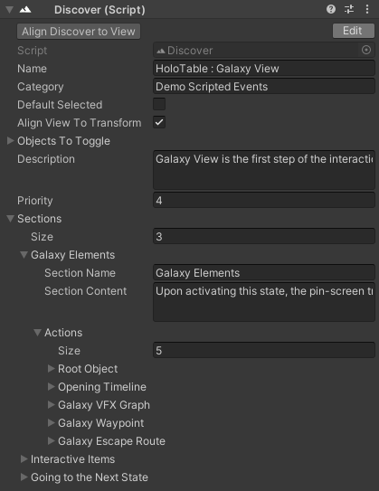

# Discover

**Version:** 2019.1.2

Discover is an Editor Window that displays user-created content in order to discover a project through a navigation window. Discover enable loading scenes or [scene setups](scene-setups.md) , then display a list of points of interest with extended options, descriptive text, and buttons to access game objects, components and assets.

## How To

* Create a Discover asset using the `Create/Discover` menu of the Project window.
* Edit the Discover Asset and customize the scene list.
* In the Scenes use the `Create/Gameplay Ingredients/Discover` menu item to create Discover Game Objects and add content to browse.

Double Click a Discover Asset to display its window. 

## Adding Discover Components in scene.

Using the Create Game Object Menu, select Gameplay Ingredients > Discover to create a new Discover Game Object. This game object holds a component to write a discover section into your Discover Window.

Discover Sections are populated one for each Discover Game Object. Upon Selecting a Discover Object it displays the following inspector as a preview of the discover Component.

In order to edit a discover component, click the edit button so it displays its editing interface.

#### Main Options

* **Name** : The name of the item in the left list.
* **Category** : The name of the category in the left list.
* **Default Selected** : If Enabled, Discover Window will select this item upon scene loading.
* **Align View to Transform** : If enabled, The discover window will align the point of view of the scene view upon selection.
  * In order to set the point of view to the current scene view, click the **Align Discover to View** button at the top of the inspector.
* **Objects to toggle** : References certain objects of the scene if they need to be enabled during the preview. The Discover Window will toggle the state of these objects if required upon selecting and will restore them to their opposite state when selecting another discover item.
* **Description :** A text paragraph that described this section.
* **Priority** : The priority index of this item in its category. Use indices in order to change priorities.

#### Sections

The Sections is an array of Section :  Every Section contains items that describes one topic of this item.

* **Section Name** : Title of the section
* **Section Content** : A paragraph that describes the section
* **Actions**: A list of actions for this section, enables accessing assets and components in the scene.
  * **Description** : Describes the action or the object to open
  * **Target** : A Generic Asset / Component to select.

#### Targets

Targets can be of any kind of Mono Behaviour or Scriptable Object but the following types can be specified for specific type:

* **Game Object** : Focuses on one Object
* **Shader** / **ShaderGraph** : Opens the Shader
* **VFX Graph** : Opens the VFX Graph
* **Timeline Asset** : Opens the Timeline in a generic manner.
* **Director Component** : Opens a timeline as an instance of this director component
* **Discover** : Navigates to another Discover

