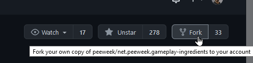

# Getting involved in Development

Gameplay Ingredients is a MIT Open-Source package developed with passion. As for any other open source project, it relies on the community in order to make it grow. However, not anybody has the time and the energy to contribute to the code of an open-source project. However, contributing does not necessarily imply to write code. 

<u>Here's a list on what you can do:</u>

* [Report bugs and issues.](https://github.com/peeweek/net.peeweek.gameplay-ingredients/issues)
* [Discuss features, UX and workflows](https://github.com/peeweek/net.peeweek.gameplay-ingredients/discussions)
* [Write and/or Review Pull Requests](https://github.com/peeweek/net.peeweek.gameplay-ingredients/pulls)

### Be respectful and polite

The package is mostly developed on free personal time, by passionate developers. So we do like polite, constructive and peaceful discussion with our community. It is often frustrating that you encounter a bug, so we are all ears and willing to help you. 

### Reporting Bugs 101

If you encounter a bug, please help us to the maximum by providing any detail that could help us. (How did it happen? General details about your project? Unity version? Are you using specific packages? Render Pipelines?) The more details you can give about how to reproduce your bug, the more likely we will be able to reproduce it, and fix it 😊.

### Feature Requests

Sometimes, there is are cases where something is missing. And we probably did not think of it yet. Feel free to file an issue using the [Feature Request] prefix in its title, try to describe how it could help you.

# Contribute with your code

Most of the code is available through public API (that rarely changes, and even more rarely breaking changes), so you are free to add features in your project. Sometimes, you will find your feature very useful, and probably want to gift it to the community. This section describes how you can contribute to the codebase with global rules.

## Fork the repository

Once in a while, you will probably modify the package for your needs, if you want to fix a bug or add functionality. Using the GitHub fork button, you will create a fork copy of the package, in which you will have push access.

## Push changes into branches, create pull requests

If you need to fix a bug, or add a feature, the best way for you is to **commit your changes in a separate branch**, then **create a pull request**.

A pull request **is a procedure where one contributor wants to merge its code into the official repository**, in order to fix a bug, or add functionality. When creating a pull request, follows a discussion between the contributor and the code maintainers of the project. In this discussion, code owners will **review** your code and check if it follows the guidelines of the project, test it, and provide feedback. Sometimes, they will ask for changes in order for it to succeed. Other times, it will be perfect and it will be good to be merged ! 

It is advised that you commit only the specific changes to the branch so the pull request stays simple. If you have multiple features, you can split in multiple pull requests, so every one of them has more chances to succeed, instead of having a big one with tons of changes requested.

## Tip: Development Packages

In order to work on a development branch, you can use a trick to obfuscate the currently installed package in unity. By cloning the package repository as subfolder of the Packages/ folder, the newly cloned package overrides the one that was previously referenced.

For instance if you cloned the Gameplay Ingredients packages into the `Packages/net.peeweek.gameplay-ingredients/` folder of your project, you will be able to modify the code and iterate with changes without having to change the `manifest.json` directly.

(You can also use git submodules using the same trick in order to keep in sync your package and your project)
