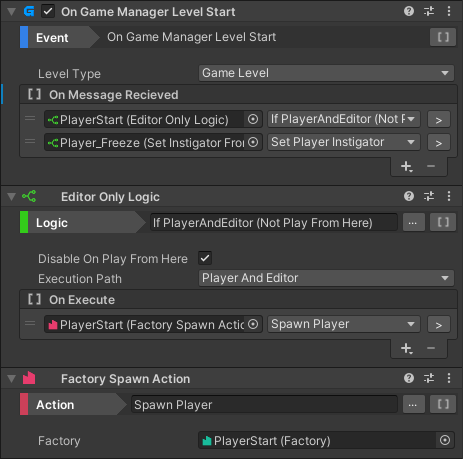

# Events, Logic and Actions

Events, Logic and Actions are Scripts that can connect together to perform Level Scripting Logic. These Scripts use [Callable](callable.md) lists to perform the link of the calls.

* [Events](reference/events.md) are triggered from Gameplay Events and will perform Calls
* [Logic](reference/logic.md) are triggered from Calls, and will trigger other Calls based on Conditions or other logic.
* [Actions](reference/actions.md) are triggered from Calls and will trigger game changes.

## Adding and Editing Game Logic

Game Logic Components can be added to game objects just like any other MonoBehaviour, through the Add Component menu. 

