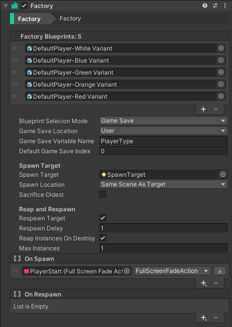

# Factories

Factory is a MonoBehaviour that enables instantiating new Game Objects from Prefab or Other Game Object blueprints. Factories handle the spawn (Random, Sequential or From a Game Save) and the handling of a count of instances, also permitting automatic respawn.

## Options

| Name                      | Description                                                  |
| ------------------------- | ------------------------------------------------------------ |
| Factory Blueprints        | A List of prefabs or scene game objects to use as reference for spawning. |
| Blueprint Selection Mode  | Enum : Method to use in order to select a blueprint for spawn. Possible Values are Random, Sequential, Shuffle or Game Save |
| Game Save Location        | If Selection Mode is set to [Game Save](game-save-manager.md), selects the game save location (System or User) to read the value from |
| Game Save Variable Name   | If Selection Mode is set to [Game Save](game-save-manager.md), defines the game save variable to read the value from. |
| Default Game Save Index   | If Selection Mode is set to [Game Save](game-save-manager.md), and Location to User : specifies the User save index to read from. |
| Spawn Target              | Defines the Target Transform to use in order to spawn the new instance. |
| Spawn Target Location     | Defines the Scene and the parenting when spawning new objects. Possible Values are **Same Scene as Target**, **Child of Target**, or **DontDestroyOnLoad** (Persistent Runtime Scene) |
| Sacrifice Oldest          | If this option is enabled, the factory will destroy the oldest instance to respawn a new one. Destroying the oldest instance this way will not trigger its respawn Calls. |
| Respawn Target            | Controls whether a destroyed instance need to be automatically respawned |
| Respawn Delay             | If Respawn Target is enabled, controls the delay before respawning an instance. |
| Reap Instances on Destroy | Controls whether the instances have to be destroyed if the factory is destroyed. |
| Max Instances             | Defines the capacity of the pool of managed instances        |
| On Spawn                  | The list of [Callables](callable.md) to be called when an instance is spawned. Instigator is the new instance object. |
| On Respawn                | The list of [Callables](callable.md) to be called when an instance is re-spawned. Instigator is the factory object. |

