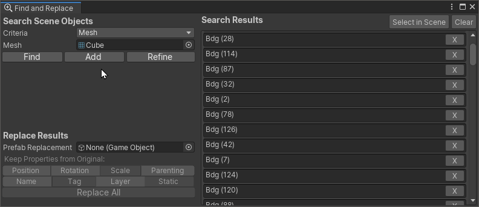

# Find And Replace

**Version:** 2019.1.2

Find And Replace is a Window that enables searching, refining and/or append to search result list based on various criteria.

#### Accessing the Window

The Find and Replace window can be accessed through the `Edit/Find and Replace` menu.

## Using the Find and Replace Window

The window is split in two panes, left pane is the inspector where you can perform search and replace the search results by other game objects or prefabs. The Right ne contains a list of search results.

### Search Scene Objects

This section enables searching scene objects based on various criteria. The search results are gathered in the right pane. You can specify a search critera using the Criteria popup, from the following:

* **Name** : If Game Object Name Contains a provided string
* **Component Type**: If Game Object owns a specific component
* **Tag**: If Game Object possess a specific tag
* **Layer**: If Game Object is set to a specific layer.
* **Mesh**: If Game Object owns a Mesh Filter with specified Mesh
* **Material**: If Game Object Has a Renderer with specified Material.
* **Selection** : Any Game Object That's currently selected (Optionally, including all its child hierarchy)

### Replace Results

The replace results section enables replacing all items in the search results by instances of a prefab or copies of a scene game object. While replacing these results you can choose to keep the following properties from the object that's being replaced:

* Position, Rotation and/or Scale
* Hierarchy Parenting
* Game Object Name
* Tag and/or Layer
* Static Flag

In order to select which properties you want to keep, please click the toggleable buttons.

### Search Results Pane

This pane presents a list of all current results

