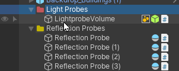
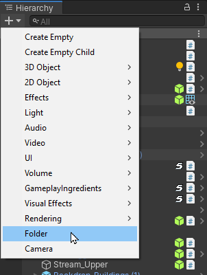
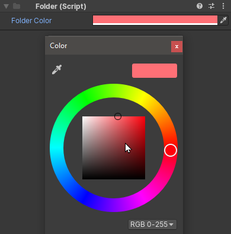

# Folders

Folders are utility scripts that turns a Game Object into a Colored folder in the hierarchy (when [Advanced HIerarchy View](hierarchy-hints.md) is active). It also ensures its host game object is static in order to save performance.

## Creating Folders

You can Create Folders using the Game Object Creation Menu, under Gameplay Ingredients category

## Editing Folders

You can Edit a folder by selecting it in the hierarchy and editing its properties in the inspector:

