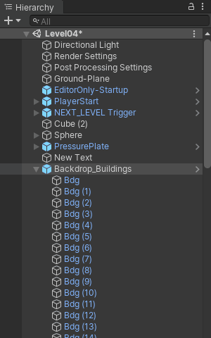

# Advanced Hierarchy View

This Feature Displays Additional Information in the Hierarchy Window, such as icons that summarize the object's components, static flags, or colored folders.

## How to Toggle

Menu : `Edit/Advanced Hierarchy View`

Shortcut `Ctrl+,`

## Displayed Information

* Left Side : (S) + Grayed Overlay for static objects.
* Right Side : A set of icons that summarize the object's components (Lights, Mesh Filters, VIsual Effects, Cameras, Scripts, etc.)
* [Folder Game Objects](folders.md)