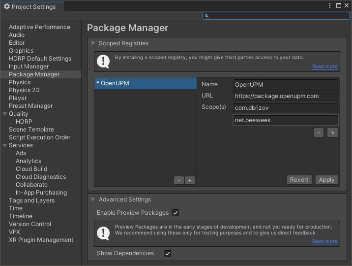

# Installing & Project Setup

Installing Gameplay Ingredients is achieved using unity package manager in two different fashions.

* **Recommended:** Using the OpenUPM registry.
* As a Git package reference, for simple use of the package
* **If you intend to modify the code**: As a local package.

## Prerequisites (Unity 2020.1 and newer)

The newer versions of Gameplay Ingredients (2020.2.0 and newer) do rely on [OpenUPM](https://openupm.com/) for other package dependencies. In order to resolve these dependencies, you need to add a scoped registry reference to your project settings.

In order to set it up, open the project settings window using the menu **Edit > Project Settings**.

In the **Package Manager** section, locate the **Scoped Registries** group and add the following scoped Registry, if not already present.

* **Name**: OpenUPM
* **URL**: https://package.openupm.com
* **Scopes**:
  * `com.dbrizov` (required for 2020.2.0 and newer)
  * `net.peeweek` (if you want to install Gameplay Ingredients via OpenUPM)

## Install using OpenUPM (Unity 2020.1 and newer)

After setting up the OpenUPM Scoped Registry in the Package Manager project settings, packages from OpenUPM scopes will be visible in the Package Manager Window.

In order to see packages from the scoped registry, select the "My Registry" in the Packages drop down (second from the left in the toolbar), select Gameplay Ingredients, and click Install.

> By expanding the foldout of Gameplay Ingredients, you can select another version to install.

## Install as Git reference 

**IMPORTANT: ** This method has to be used for Unity 2018 and 2019 versions. For unity 2020 and newer, prefer the OpenUPM install version.

> **Prerequisites: ** On Windows, You will need the [Git for Windows](https://gitforwindows.org/) command line client installed on your machine (using install defaults). Once installed, you will need to restart your computer.

In order to use the package as a git reference, you will need to copy the **https** git reference address and add it to the package manager window using the "Add package from git URL" :

The git URL is available on the main repository page at GitHub, cy clicking the green Code button, selecting the HTTPS protocol, and clicking the Copy button.

The URL should be the following:

`https://github.com/peeweek/net.peeweek.gameplay-ingredients.git`

You can specify specific version by adding a `#20XX.X.X` suffix to the address so it will install to a specific release of the repository. For instance, the `2019.3.7` version URL will be:

`https://github.com/peeweek/net.peeweek.gameplay-ingredients.git#2019.3.7`

## Install as Local Package

In order to use the package as local reference, you will need to download a copy of the package and reference it locally. Downloading the package can be achieved :

- By downloading the source code from the [releases](https://github.com/peeweek/net.peeweek.gameplay-ingredients/releases) page.
- Using a git client (eg: [fork](https://fork.dev)), by cloning the repository.

The package can be downloaded and extracted anywhere accessible on your machine. In order to install the package in your project, use the [Package Manager Window](https://docs.unity3d.com/2020.2/Documentation/Manual/upm-ui.html) to install the package from a local path. By selecting Add package from disk, locate the `package.json`

