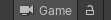

# Link Game View

Link Game View enables previewing in the game view the same point of view as in the Scene View. This feature works as well in runtime mode, and you can lock the point of view to a particular scene view in case you would be working with multiple scene views.

## Activating Link

You can Activate a link by clicking the Link Game View Button in the Additional Scene View Toolbar.

Clicking the Lock Button will turn the button group to Green and will ensure this game view  link is locked so it doesn't change when you focus another scene view.

