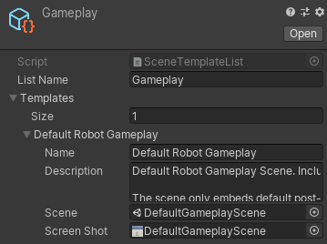

# New Scene from Template

This feature enables the creation of new scenes, based on other scenes defined as templates in the project. You can create a new scene or add additively from a template.

## Using the New Scene from Template Window

In order to select which scene to add, you can use the `File/New Scene from Template...` menu item to display the New Scene From Template window.

On the left part of the window, you can find categories where the templates are grouped into. To select a template, click its name in the list. 

Upon selecting a template, its description will appear in the right part of the window, displaying its title, description and optionally a screenshot.

## Scene Template Set-Up

New Scene Templates can be set-up using a **Scene Template List** asset. You can create these assets using the `Create/Scene Template List` menu in the project window.

Every Scene Template List contains a group of Scene Templates assorted as a category in the window.

You can edit these assets in the inspector by adding new Templates to the Template List, and filling in the Name, Description, Reference Scene and Screenshot.

