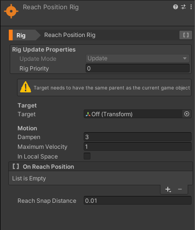

# Rigs

Gameplay Ingredients comes with a set of built-in rigs that help define behaviors for your game objects. Rigs are components that manipulate objects in a every-frame manner.

As such, these rigs are updated via a single update in order to save performance, and make them configurable enough.

## Rig Update Properties

Rigs can be configured using various properties

* **Update Mode** : in which update loop the rig can be updated
* **Rig Priority** : a scalar order number that allows some rigs to be updated before others. Lower values are updated first.

