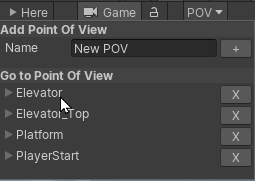

# Scene Point of View

Scene Point of View is an editor utility that enables navigating a scene through pre-recorded point of views.

## How to Use

Click the POV Drop-Down button on the additional Scene View Toolbar to access the Scene POV pop-up. 

* Use the **Add point of view** section to add a new named Point of View from your current Scene View Point of View.
* Use the **Go to Point of view** section items to go to a particular Point of view.
* Use the **X** buttons in **Go to Point of view** section items to **delete** a particular Point of view.