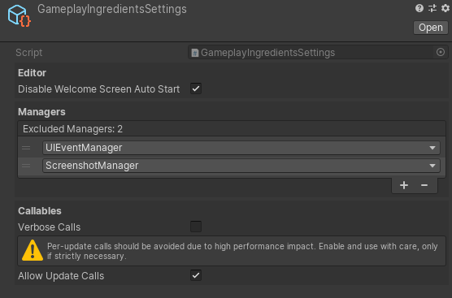

# Gameplay Ingredients Settings

Gameplay Ingredients Settings is an optional, project-wide setting asset that contains customization options for Gameplay Ingredients.

## Creating Settings

You can create the settings file through the Setup Wizard in the [Welcome Screen](welcome-screen.md) window.

The file will be located in your `Assets/Resources/` folder.

## Settings

| Name                              | Description                                                  |
| --------------------------------- | ------------------------------------------------------------ |
| Disable Welcome Screen Auto Start | Disables completely the ability to have a **Show at Startup** behavior for the [Welcome Screen](welcome-screen.md) window. |
| Excluded Managers                 | Set up a list of exclusion for [managers](managers.md). Types referenced in this list will not be spawned at game startup. |
| Verbose Calls                     | Enable Logging when a [callable](callable.md) is executed. This has a serious impact on performance and shall be disabled when building your game. |
| Allow Update Calls                | As Per-Update can be slow, we do not advise calling [callables](callable.md) every frame. You can still activate this option if you really need it. |

