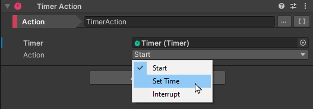

# Timers

Gameplay Ingredients implement timers for your games. A timer is a script that you can control by Starting, Stopping or Resetting.

Timers can perform Actions upon Interruption, Start or Reset.

## Using Timers

Timers rely on the Timer Component which is a monobehaviour in charge of tracking time. A Timer counts down a given duration and can be interrupted before it reaches zero. Based on interruption or completion, it can execute [Callables](callable.md).  

Timers can be interacted with using a **TimerAction**. This action can perform state change to a given timer.

Timer Actions can perform the following:

* Interrupt
* Start
* Set Time

